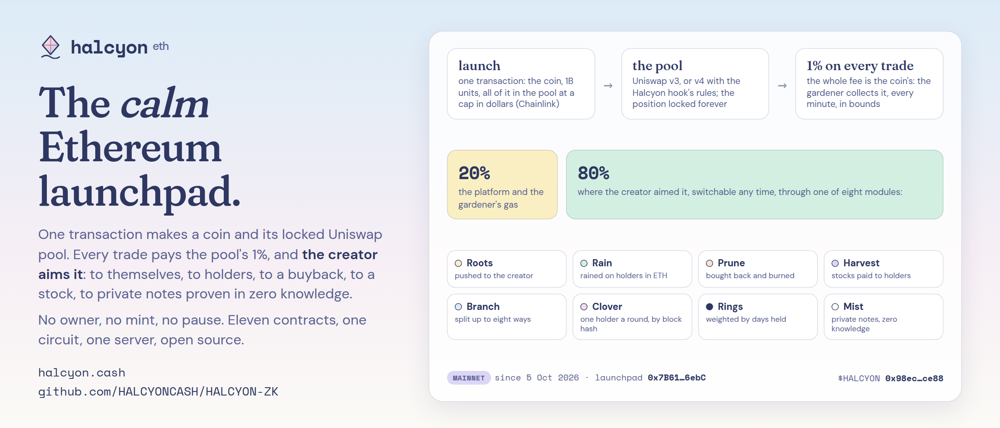
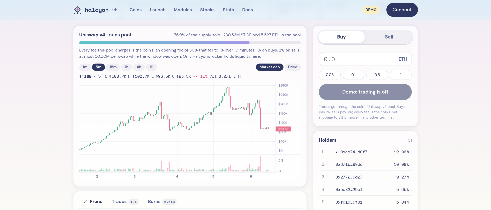
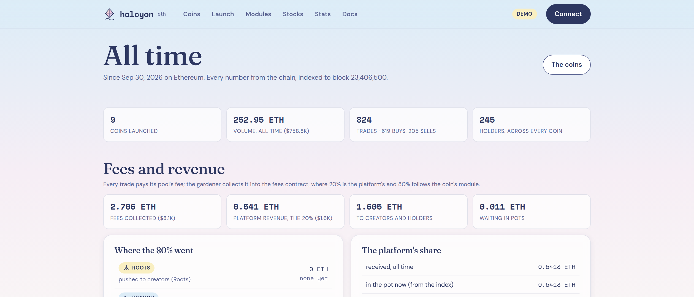

<p align="center"></p>

<h1 align="center">Halcyon</h1>

<p align="center"><b>The calm Ethereum launchpad.</b> One transaction makes a coin and its locked Uniswap pool. Its 1% fee goes where the creator decides. Payouts can be private, proven in zero knowledge.<br>
<a href="https://halcyon.cash">halcyon.cash</a> · <a href="https://x.com/halcyoncash">@halcyoncash</a> · live on Ethereum mainnet since 5 October 2026</p>

<p align="center">
<a href="https://etherscan.io/address/0x7B618B3AE41E415cf4c5B16d16CCa53a39eb6ebC"></a>
<a href="https://etherscan.io/token/0x98eca0aa1e962cd5ea7f4f24785a22d5084fce88"></a>


</p>

---

## What it is

Halcyon launches coins on Ethereum mainnet into Uniswap pools that nobody can touch. A launch is one transaction: the coin (a billion units, every one of them in the pool from the first block) and a single-sided Uniswap position at a starting cap you pick in dollars, priced by Chainlink, locked in a contract whose only power is to collect fees. There is no bonding curve to graduate from and no migration: **the pool is the curve**, buys walk the price up, sells walk it back, and the liquidity stays forever.

Every trade pays the pool's 1%. Because Halcyon holds all of a pool's liquidity, the whole 1% is the coin's: the gardener (one hot key the platform runs) collects it, **20% keeps the platform and the gardener running, 80% goes where the creator aimed it**, through one of eight modules the creator can switch at any time:

| Module | The 80% |
| --- | --- |
| **Roots** | pushed to the creator the moment it lands |
| **Rain** | rained on holders in ETH, pro rata, in batches |
| **Prune** | buys the coin back through its own pool and burns it |
| **Harvest** | buys a tokenized stock (Ondo's NVDAon, TSLAon, SPYon and others) and pays it out to holders |
| **Branch** | pushed to up to eight addresses in shares the creator set |
| **Clover** | one holder a round takes the whole pot, drawn by a block hash anyone can check |
| **Rings** | rained on holders weighted by balance times days held, up to thirty |
| **Mist** | holders paid as private notes in a zero-knowledge pool, spent with a proof to any address |

Two kinds of pool: **Standard** (Uniswap v3, 1%) and **Rules** (Uniswap v4 with the Halcyon hook): an opening fee that starts as high as 90% and falls to 1% over a window the creator sets (up to a day), so snipers pay the holders; a max per swap while the window is open; a sell fee (up to 5%); one liquidity provider. The hook enforces what was picked at launch and nobody can change it afterwards, which is the point of a rule.

The whole thing is eleven small contracts, one circuit, one Node server (the site, the indexer, the gardener, the mist relayer) and a React site in the Ethereum Foundation's pastel manner. This repository is the whole thing.

<p align="center"></p>
<p align="center"><sub>A coin page, in demo mode (<code>npm run start:demo</code>: ten sample coins on the real pool math, no chain behind them). The live site is <a href="https://halcyon.cash">halcyon.cash</a>.</sub></p>

## Live on mainnet

Everything the site and the gardener use comes from [`deployments/mainnet.json`](deployments/mainnet.json), the record the deploy script wrote (every address, every deployment transaction, the CREATE2 salt of the hook). The compiler's standard-input JSON for every contract is in [`contracts/artifacts/`](contracts/artifacts), so anyone can match the source to the bytecode on Etherscan; `scripts/verify.mjs` is how it was submitted.

| Contract | Role | Address |
| --- | --- | --- |
| **$HALCYON** | the platform's own coin, launched through the launchpad like any other (no premine, no special code; it runs on Prune at the time of writing: its fees buy it back and burn it) | [`0x98ECA0AA1E962Cd5Ea7F4F24785a22d5084fCe88`](https://etherscan.io/token/0x98eca0aa1e962cd5ea7f4f24785a22d5084fce88) |
| Halcyon | the launchpad: a coin and its locked pool in one transaction; no privileged function | [`0x7B618B3AE41E415cf4c5B16d16CCa53a39eb6ebC`](https://etherscan.io/address/0x7B618B3AE41E415cf4c5B16d16CCa53a39eb6ebC) |
| HalcyonFees | every fee lands here; the 80/20; the pots and the eight modules under the gardener's bounds | [`0x5E2d61F8DF43c3822874265a5BA465bD9C817c0e`](https://etherscan.io/address/0x5E2d61F8DF43c3822874265a5BA465bD9C817c0e) |
| HalcyonToken | the coin: every coin is an EIP-1167 clone of this implementation, which is locked and never a coin itself | [`0x77CC56f66c6d9cDc4Cf99166b2843b0Bd51C4a15`](https://etherscan.io/address/0x77CC56f66c6d9cDc4Cf99166b2843b0Bd51C4a15) |
| HalcyonLocker | holds every Uniswap v3 position forever; collects for the gardener | [`0xC500AacF89e7b71603e548Ab30071b44D68b5F91`](https://etherscan.io/address/0xC500AacF89e7b71603e548Ab30071b44D68b5F91) |
| HalcyonV4Locker | the same for Uniswap v4 positions | [`0x971899de5a477d2454C182276d27c6ad4A428D65`](https://etherscan.io/address/0x971899de5a477d2454C182276d27c6ad4A428D65) |
| HalcyonHook | the rules of every v4 pool, at an address whose low bits spell its permissions | [`0x313EA55aA2dF26138b1Df5CF04feF6Af030e98c0`](https://etherscan.io/address/0x313EA55aA2dF26138b1Df5CF04feF6Af030e98c0) |
| HalcyonSwap | the simplest router for v4 pools, and the multi-hop path Harvest buys stocks through | [`0x0999bC1e733b6ED29d9b6372169168A000cd6F20`](https://etherscan.io/address/0x0999bC1e733b6ED29d9b6372169168A000cd6F20) |
| HalcyonMist | the pool of private notes (0.01, 0.1 and 1 ETH) | [`0x3720C2a9950Aefd5AaCCa9F1dA883CABda543E5b`](https://etherscan.io/address/0x3720C2a9950Aefd5AaCCa9F1dA883CABda543E5b) |
| MistVerifier | the Groth16 verifier of the withdraw circuit | [`0x354B35ADA4E9D18077ab67b6c86bEDeeFf0DE15e`](https://etherscan.io/address/0x354B35ADA4E9D18077ab67b6c86bEDeeFf0DE15e) |
| PoseidonT3 | the hash of the mist tree | [`0x1CF4111BD1cba48F5F30eFe566Bded99BdB294ff`](https://etherscan.io/address/0x1CF4111BD1cba48F5F30eFe566Bded99BdB294ff) |

The first contract went in at block 26,128,417. The deployer wired the fees contract once and set the mist pool once, and has no power now. The platform wallet owns one contract (HalcyonFees) and can only withdraw the platform pot, rotate the gardener, allow stocks and hand itself over. [`docs/deployment.md`](docs/deployment.md) has the wallets, the Uniswap and Chainlink addresses, the circuit's setup and the operations.

## How a launch works

1. The creator fills the form on [halcyon.cash/launch](https://halcyon.cash/launch): name, symbol, picture and links (pinned to IPFS), a starting cap in dollars ($1,000 to $1,000,000), the pool (Standard or Rules, with its rules), the module, and an optional first buy.
2. `Halcyon.launch` clones the token implementation (EIP-1167, 1,000,000,000 coins to the launchpad), creates the pool at the tick the Chainlink ETH/USD answer puts the cap at, mints one single-sided position with every coin in it and hands the position to the locker, registers the coin with the fees contract (creator, module, stock), prepares the hook's rules for a v4 pool, and makes the first buy if the creator asked for one. One transaction; the coin is trading in the same block.
3. From then on the pool's 1% accrues to the position. The gardener collects it into HalcyonFees (`deposit`: 20% to the platform pot, 80% to the coin's pot or straight to the creator under Roots and Branch) and runs the module.

Nothing in the coin can be changed later: no owner, no mint, no pause, no blacklist, no tax switch. The creator keeps two levers, both in the fees contract: the module (`setModule`) and the creator role itself (`setCreator`). The pool kind, its rules and the starting cap are fixed at launch.

## Mist: private payouts, proven in zero knowledge

Mist is for coins whose holders would rather not have their income read off the chain. It is not a mixer: nothing enters the pool but Halcyon's own fee payouts.

- **The key.** A holder registers a mist key once (`HalcyonFees.setMistKey`): two public keys on Baby Jubjub, a spending key and a viewing key, derived in the browser from one signature of a fixed sentence. Nothing else is stored anywhere.
- **The round.** When a Mist coin's pot is worth paying, the gardener cuts every keyed holder's share into notes of the pool's denominations (0.01, 0.1 and 1 ETH; the remainder becomes one more smallest note by lot, so nothing is lost in expectation and no fraction is remembered), each note a fresh commitment only that holder can recognise (a Poseidon hash of the holder's spending key and a shared secret from an ephemeral key, with a view tag for cheap scanning), shuffled, and sown into the pool's Merkle tree in one transaction (`payMist`). Holders without a key are paid in the open, like Rain. The ledger names counts and denominations; nothing anywhere links a note to a holder.
- **Finding a note.** The site's Me page derives the keys from the signature, reads the public feed of notes and scans it with the viewing key: one curve multiplication and a hash per note (two when the view tag matches), in the browser.
- **Spending a note.** The browser rebuilds the tree from the feed and makes a Groth16 proof (BN254, 7,106 constraints, Poseidon everywhere): the note is in the tree, the spending key is the holder's, and here is its nullifier so it spends once. The proof names a recipient (any address, or ENS), a relayer and a fee. `HalcyonMist.withdraw` checks the proof with the verifier, that the root is one the pool sowed, that the nullifier is new, and pays the recipient. The site's relayer sends it for the fee the proof fixed, so the receiving wallet needs no ETH and no history; a holder with a funded wallet can send it alone.
- **What is public, what is not.** Public: every note's commitment, denomination, batch and coin; every withdrawal's denomination, destination, relayer and fee; who holds a mist key. Not public: which note is whose, and which withdrawal spent which note.
- **The circuit.** [`zk/circuits/withdraw.circom`](zk/circuits/withdraw.circom), tree depth 22 in batches of 64. The setup was built on `ppot_0080_14.ptau`, the Ethereum Foundation PSE's Perpetual Powers of Tau (contribution 80, with a randao beacon) prepared for phase 2, with one Halcyon contribution whose entropy was random and never written down. [`zk/setup.json`](zk/setup.json) records the ptau's sha256 and the hashes of the zkey, the wasm, the verifier and the verification key; [`zk/setups/`](zk/setups) keeps the five files as built; the verifier on chain was compiled from that setup.

### Check it rather than trust it

Reads only, no key, with any mainnet RPC in `ETH_RPC_URL`:

```sh
node scripts/mist.mjs check                 # the pool on chain; is the verifier's bytecode on mainnet the MistVerifier compiled here? do the zkey and wasm match the recorded setup?
node scripts/mist.mjs prove                 # make a note here, prove its withdrawal (about 2 s), verify it with the verification key, then ask the verifier on mainnet with an eth_call: true
node scripts/mist.mjs trail 0xTOKEN         # a Mist coin's trail with every transaction: keys set, rounds sown (batch, notes, root), payments in the open, the pool's spends
node scripts/mist.mjs spends                # every note ever spent from the pool: each a proof the verifier accepted
```

`prove` also shows the pool's two further checks on that very proof: the root is not one the pool sowed and the nullifier is new, so the pool would refuse the withdrawal all the same. The proof is sound and the pool is strict.

## The gardener

The one hot key the platform runs, funded by the platform's 20%. Every minute it looks at every coin and does what is due: collects pool fees, pays the modules, opens and settles clover draws, sows mist rounds, relays mist withdrawals. The contract bounds it: a coin's pot can only reach that coin's holders (each checked on chain to hold the coin), that coin's buyback or that coin's allowed stock, or notes of the pool's denominations; it cannot move liquidity, change a module or touch the platform pot.

It works in thresholds and in patience, so gas never eats a payout: a coin's fees are collected at once from 0.02 ETH and a pot is paid at once from 0.05 ETH; under that, every coin is still tended every fifteen minutes as long as what is due is worth ten times its gas at the moment's gas price. Every transaction goes out with fees of its own (twice the base fee plus a tip, under a cap), one at a time, followed until it is in a block, re-sent higher when it sits. Every action, taken or refused, is a line in a public ledger.

```sh
node scripts/gardener.mjs                   # on or off, the transaction out right now, the last ledger lines (reads the site's /api/gardener)
node scripts/gardener.mjs plan              # every coin as the gardener sees it: module, holders, pool fees, pot, what is due, why it waits
```

[`docs/gardener.md`](docs/gardener.md) has the whole of it.

## The site

Home (the numbers, the coins trading now), Coins (search, sort, filters, pages; the platform's coin first; a coin launched minutes ago wears a chip, a coin that arrives while you watch sparkles for half a minute), a coin page (a candle chart on TradingView's Lightweight Charts with six frames and a price or market cap scale that follows the trades live; the pool and its rules with the opening countdown; the trade panel; one card for the module and its payouts, the trades and the burns; the holders; the creator's module switch), Launch (a four-step form with a live summary), Modules, Stocks, Stats (everything since the first launch: launches by pool and module, volume, fees and where every part went, the platform's share, buybacks and burns coin by coin, holders, the mist, day by day), Docs, and Me (holdings, launched coins, claims, the mist keys and notes).

Wallets are found with EIP-6963; the site asks for a signature only for a launch, a trade, a claim, a module change, a mist key and the mist sentence. Trades go through the coin's own pool (SwapRouter02 for v3, HalcyonSwap for v4) with the server's quote and a slippage guard.

<p align="center"> </p>
<p align="center"><sub>The coins and the Stats pages, in demo mode. <code>node scripts/previews.mjs</code> draws these four pictures from the demo.</sub></p>

## Run it

Node 22 or later.

```sh
git clone https://github.com/HALCYONCASH/HALCYON-ZK.git && cd HALCYON-ZK
npm ci
npm run build
npm run start:demo        # http://localhost:4180: the whole site on ten sample coins computed with the real pool math, no chain behind it
```

Against mainnet, the site, the indexer and the gardener need two things in `.env` (copy `.env.example`): `ETH_RPC_URL` and, to send anything, `HALCYON_GARDENER_KEY` with `HALCYON_GARDENER_ENABLED=1`. Every address comes from `deployments/mainnet.json`. `npm start` serves the site and follows the chain from the deploy block (a minute or two the first time).

```sh
npm run contracts:compile # solc 0.8.28 (via IR, 2000 runs, cancun): abi, bytecode and the standard-input JSON Etherscan verifies
npm run check             # tsc, 20 contract checks, 15 server checks, 53 deploy checks, 90 browser checks (about five minutes)
```

- `tests/contracts.test.mjs`: the contracts on an in-process EVM with the real Uniswap v3 and v4 bytecode from the published builds: launches on both pools at the cap the feed says, the pool against the JS math to one part in a billion, the lock, collect and the 80/20, every rule of the hook, every module including stock buys through v3 and v4, clover draws, a mist round sown, found, proven and withdrawn against the real verifier.
- `tests/modules.test.mjs`: the server's indexer and gardener against that chain, end to end: the sender (fees, bumps, a replaced nonce), the patience, the candles, the all-time numbers, the API, the demo server.
- `tests/deploy.test.mjs`: `scripts/deploy.mjs`, `admin.mjs`, `stocks.mjs` and `mist.mjs` against a `hardhat node` on a port.
- `tests/ui.test.mjs`: every page in a headless Chromium against the demo server (skipped when no Chromium is found).

Before a push, `node scripts/publish-check.mjs` reads every file git would send for the shapes of what must stay on the machine (environment files, keys, API tokens, seed phrases, zips, ceremony files) and stops with each find masked. The CI (`.github/workflows/check.yml`) runs it, then the build, then `npm run check`, on every push.

## Deploy your own

The contracts have no owner and the launchpad no privileged function, so anyone can run a launchpad of their own on Halcyon's code. Everything is done with your own keys on your own machine; a Sepolia run first (`CHAIN_ID=11155111`, ten minutes, no value at stake) shows your RPC, your keys and the script agree.

**1. Three addresses.** A *deployer* (a fresh key, pays the gas, used once and forgotten), a *platform wallet* (owns HalcyonFees; a hardware or cold wallet), a *gardener* (the server's hot key, funded with a little ETH for gas). The platform and the gardener must differ. Keys go in `.env`, never in a chat, a screenshot or a commit; `.gitignore` keeps `.env` out.

**2. The circuit on a public ceremony.** Build the setup on a public powers of tau prepared for phase 2 (power 14 is enough for the 7,106 constraints); the deploy script refuses a development setup on mainnet:

```sh
curl -L -o ppot_0080_14.ptau https://pse-trusted-setup-ppot.s3.eu-central-1.amazonaws.com/pot28_0080/ppot_0080_14.ptau
node zk/build.mjs --ptau ppot_0080_14.ptau     # compiles, runs the Groth16 setup with one fresh contribution, writes the verifier, the verification key and the browser artifacts, keeps a copy in zk/setups/
npm run contracts:compile && npm run check
```

The verifier you deploy and the prover the site serves must come from the same build; `node zk/build.mjs --restore zk/setups/<dir>` puts a kept build back.

**3. Deploy.** `.env`: `CHAIN_ID`, `ETH_RPC_URL`, `HALCYON_PLATFORM`, `HALCYON_GARDENER`, `HALCYON_DEPLOYER_KEY` (and `HALCYON_DEPLOY_MAX_GWEI` to wait for a quiet hour; the whole deploy is about 21 million gas).

```sh
node scripts/deploy.mjs           # dry: checks the chain id, the Uniswap addresses, the PoolManager, the feed and the setup; estimates everything; sends nothing
node scripts/deploy.mjs --go      # deploys the eleven, wires fees, points it at the mist pool, writes deployments/<chain>.json; resumable, a run cut short continues with the next --go
```

**4. Verify.** `ETHERSCAN_API_KEY=… node scripts/verify.mjs` submits every contract's standard-input JSON with the constructor arguments rebuilt from the record.

**5. Forget the deployer.** Remove `HALCYON_DEPLOYER_KEY` from `.env`. The platform wallet's few actions come as calldata from `node scripts/admin.mjs set-gardener | set-platform | withdraw-platform`, sent from a browser wallet or from the script with `--go` when `HALCYON_PLATFORM_KEY` is in `.env`.

**6. Stocks** (optional). `node scripts/stocks.mjs catch --all --go` asks the chain where each tokenized stock trades and routes the best pool; `bake` writes the seed; `allow --routed --go` allows the routed ones on chain from the platform wallet. Read the legal note in [`docs/modules.md`](docs/modules.md) first: the issuers bar US persons.

**7. Host.** [`render.yaml`](render.yaml) describes one web service with a 1 GB disk; the dashboard needs `ETH_RPC_URL` and `HALCYON_GARDENER_KEY` (`PINATA_JWT` and `PINATA_GATEWAY_URL` to pin launches to IPFS, `HALCYON_PLATFORM_COIN` to mark your platform's coin, `HALCYON_HIDDEN_COINS` to keep lookalikes out of the lists). Start with the gardener off, fund it, turn it on.

## Security

- **No admin key can touch a coin.** No owner, mint, pause, blacklist, tax or fee switch on the token; no privileged function on the launchpad; liquidity held by contracts with no way to move it.
- **The platform wallet** owns one contract and can only withdraw the platform pot, rotate the gardener, change itself and allow stocks.
- **The gardener** can only move a coin's pot into that coin's holders, buyback or allowed stock, each recipient checked on chain, or into notes of the pool's denominations (the one place the chain cannot check the recipient; a stolen gardener key could sow a round to keys of its own, and nothing more). The mist pool has no owner and pays nothing without a proof.
- **The hook** only serves pools the launchpad prepared, only lets the locker add liquidity, and only sets fees; it holds no funds.
- **Keys.** The gardener key is read from the environment, never logged or served; the site never sees it. Mist keys never leave the browser. The `/api/rpc` proxy allows reads and signed transactions relayed as they are, rate limited; `/api/mist/relay` verifies a proof before the gardener's key spends gas on it.
- **Audits.** The contracts are tested against the real Uniswap bytecode on a local EVM and have not been audited. The circuit and its setup are documented above so anyone can rebuild the verifier and compare. Treat it as new code on mainnet, because it is.

Found something? See [`SECURITY.md`](SECURITY.md).

## Layout

```
contracts/      HalcyonToken.sol (the coin, EIP-1167 clones), HalcyonFees.sol (the split, the eight modules, the mist keys, the gardener's bounds), Halcyon.sol (the launchpad),
                HalcyonLocker.sol, HalcyonV4Locker.sol (positions, forever), HalcyonHook.sol (the rules), HalcyonSwap.sol (the v4 router), HalcyonMist.sol (the note tree, the proofs, the nullifiers),
                MistVerifier.sol (Groth16, generated from the circuit), PoseidonT3.sol, Create2Deployer.sol, Interfaces.sol, mocks, compile.mjs, artifacts/
zk/             circuits/withdraw.circom, build.mjs (circom, the setup, the verifier, the browser artifacts), setup.json, verification_key.json, setups/ (the build as deployed)
shared/         pool.mjs (the pool math in BigInt, shared by site, server and tests), mist.mjs (keys, notes, scanning, the tree, the witness; the browser and the gardener run the same code)
eth/            config, chain clients, contract bindings, store, indexer, series (day and hour buckets), candles, gardener, sender, mist (the relayer), stocks, markets, pinata, meta, demo
server.mjs      the HTTP server: the API, metadata and image hosting, the RPC proxy, the site, /zk/
src/            the React site (Vite): pages, components, wallet, mist in the browser
scripts/        deploy.mjs, verify.mjs, admin.mjs, stocks.mjs, gardener.mjs, mist.mjs, publish-check.mjs (nothing secret in a push), previews.mjs (the pictures)
tests/          contracts, modules, deploy, ui
docs/           model, modules, gardener, deployment, brand (the guide, and brand/ with the pictures)
deployments/    mainnet.json, the record every address comes from
.github/        the checks on every push
```

[`CONTRIBUTING.md`](CONTRIBUTING.md) has the setup, the checks and the house style.

## Lineage

Uniswap v3 and v4 (the pools, the hook) and Chainlink (the ETH/USD feed) are the ground. Mist's notes, nullifiers and Merkle tree proved in Groth16 are the Zerocash and Tornado Cash lineage. The way a holder's notes are addressed follows Vitalik Buterin's "An incomplete guide to stealth addresses" and ERC-5564 (a spending key, a viewing key, an ephemeral key per note, a view tag); the stance that the pool is not a mixer follows the Privacy Pools paper (Buterin, Illum, Nadler, Schär, Soleimani, 2023), in the simplest form: only Halcyon's own payouts can enter. The ceremony is the Ethereum Foundation PSE's Perpetual Powers of Tau; the circuit is circom and snarkjs; Poseidon on chain is poseidon-solidity; the charts are TradingView's Lightweight Charts. Inspired by, not endorsed by.

## License

MIT. See [`LICENSE`](LICENSE).
